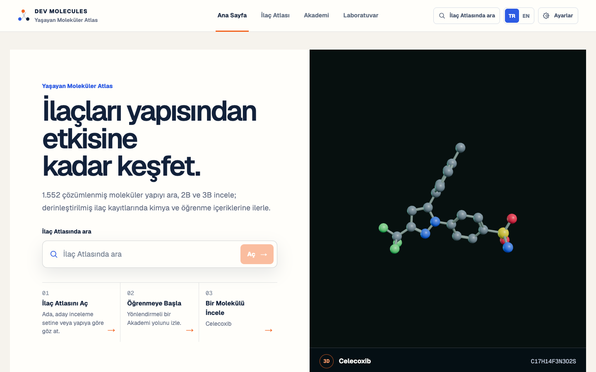

# Molevren — Public Alpha

Molevren is a bilingual, student-first pharmaceutical molecular atlas and academy. It connects source-resolved identity and structure to learning journeys without presenting missing, predicted, or educational content as verified science. **Dev Molecules remains the technical platform and repository name; Molevren is the reversible public working brand pending professional trademark clearance.**

[Live application](https://pharmacist65.github.io/dev-molecules/) · [Public repository](https://github.com/Pharmacist65/dev-molecules)

**Release boundary:** this repository is a public engineering, brand, and curriculum alpha. It is not a complete approved-drug database, peer-reviewed scientific publication, clinical decision tool, laboratory protocol, patent assessment, trademark clearance, or autonomous discovery system. V2.1 remains the frozen integrity baseline documented in [Dev Molecules V2.1](docs/V2_1_RELEASE_BLOCKER_SPRINT.md); the public-brand and flagship Phase A layer is documented below.

## Product architecture

The primary navigation is deliberately small:

- **Home** — search over the 1,552-record structure index, one lazily loaded molecular object, and clear paths into Atlas, Academy, and the molecular-record flow.
- **Drug Atlas** — **Browse** pages through the 1,552 imported structure records in the checked snapshot; **Spatial** is an optional, lazily loaded representative Three.js view. Two bounded Family review workspaces compare four exact identity/2D records each while keeping unsourced family science empty. The spatial sample and Family representatives are never presented as catalog coverage.
- **Academy** — an eight-module map that distinguishes working lessons, coverage-dependent lessons, and planned curriculum.
- **Lab** — an on-device Ketcher structure editor, curated comparison, local evidence cards, and an explicitly unavailable private-research beta.

The Explore, Learn, Build, Teach, and Discover north star is preserved as product capability, not as five equal top-level tabs. Existing `#explore`, `#learn`, `#build`, `#teach`, and `#discover` links have deterministic compatibility routes. Existing molecule, cluster, and comparison hashes still open the Spatial Atlas.

Student is the public scientific presentation across Home, Atlas, Academy, Synthesis, and Lab. The current Expert preference changes only curated Drug Dossiers to open in Reference mode by default; the rest of the public surfaces retain the same learner-safe science view. No denser measurement, assay, comparison, or export workflow is shipped for Expert. Reviewer is not an Expert alias: it is a separate authorization domain and stays locked on the public host because no authenticated, audited reviewer adapter is injected.

Read [Release status](docs/RELEASE_STATUS.md), [Product context](docs/PRODUCT_CONTEXT.md), and [Student experience](docs/STUDENT_EXPERIENCE.md).

## Current catalog and dossier coverage

The checked snapshot evaluates every row in the selected DrugCentral FDA list. That source selection is exhaustive for this snapshot, but it is not the exact FDA product/application universe or a global approved-drug inventory.

| Measure | Checked-in result |
| --- | ---: |
| DrugCentral FDA-list rows evaluated | 2,331 |
| Rows with a complete same-ID DrugCentral structure | 1,858 |
| Exact unique InChIKey → PubChem CID resolutions | 1,747 |
| Imported records with a complete checked 2D + 3D pair | 1,552 |
| Unresolved source rows retained fail-closed | 779 |
| PubChem SDF assets | 3,104 (1,552 × 2D/3D) |
| Alphabetic / therapeutic shards | 25 / 1 (`unclassified`) |
| Product/application links unresolved | 2,331 |
| Generated therapeutic classifications unresolved | 1,552 |

The 779 unresolved rows are accounted for without name-based identity guessing: 473 lack a complete same-ID DrugCentral identity structure, 111 do not resolve to one exact unique PubChem CID, and 195 lack a complete checked 2D/3D pair.

Catalog breadth and scientific depth are separate:

- Atlas Browse searches and pages through all 1,552 imported records, then loads one shard/entity and requested structure through bounded caches.
- Every one of the 1,552 resolved identities has a stable record route and a Basic Molecular Record boundary: source-matched identity, real 2D and computed 3D structures, provenance, conservative properties when present, and explicit nine-dimension coverage.
- The fixed Atlas seed remains 15 records. A separately reviewed Omeprazole identity brings the Curated Dossier registry to 16 without widening the seed Atlas.
- Exactly three dossiers—Propranolol, Celecoxib, and Omeprazole—implement the Phase A flagship section set across source-scoped pharmacology, route/form-specific ADME, metabolite boundaries, nomenclature, comparisons, and learning. This is not a claim that every end-to-end scientific journey is complete. Their static dossier synthesis sections make no independent evidence or route claim; each exact identity's current state comes from the generated Synthesis Atlas. Pending public-alpha drafts, when available, remain separate from reviewed/verified canonical routes. The other 13 curated records retain their explicit V2.1 gaps.
- The scalable enrichment readiness report still has two active source adapters, zero configured enrichment snapshots, zero enriched classifications, zero enriched pharmacology profiles, and zero enriched ADME profiles. The three hand-curated flagship records do not masquerade as catalog-wide enrichment coverage.
- Basic Record and Curated Dossier identity/structure fields are source-linked. Classification, target, ADME, metabolite, synthesis, nomenclature, and learning coverage are independently gated.
- The generated catalog has no reviewed target-interaction or ADME snapshot. Only the three named flagship dossiers carry audited, source-resolved target/action and route/form-specific ADME records; their metabolite edges preserve activity holds and never generalize beyond the cited context.

See [Catalog pipeline](docs/CATALOG_PIPELINE.md), [enrichment readiness](public/catalog/reports/enrichment-readiness.json), [coverage](public/catalog/reports/coverage.json), and [unresolved rows](public/catalog/reports/unresolved.json).

## Academy and synthesis truth

The Academy map has eight modules:

- five currently available routes: Structure Language, Organic Nomenclature, Pharmaceutical Nomenclature, Synthesis Atlas, and Drug Review Project;
- two coverage-dependent shells: Pharmacology and ADME;
- one planned standalone curriculum: Reaction Mechanisms. No route-derived mechanism task has passed the public review-and-reuse gate yet.

The interactive Nomenclature Academy contains eight ordered sections and 22 exercises over 20 parseable 2D structures, using 16 concrete response/widget contracts. Evaluation is deterministic; the four-record local name↔structure adapter is not a general IUPAC parser.

Every one of the 1,552 Basic Molecular Records exposes a synthesis coverage record. The accepted discovery snapshot contains 14,897 molecule–evidence associations, all with terminal extraction outcomes. A local private migration archive records six historical pending/link-only canonical drafts; public CI retains only their privacy-safe aggregate and does not revalidate those rows. Separately, the generated public-alpha channel exposes 2,645 source-supported partial alternatives in 639 exact-identity graphs, with exact ORD locators, independent 2D redraws, explicit gaps, no operational details, and a persistent expert-review-pending label. The official reviewed/verified route index remains empty.

Synthesis content is non-operational: it omits quantities, scale, apparatus, execution conditions, work-up, purification, yield, and manufacturing instructions. See [Synthesis provenance](docs/SYNTHESIS_PROVENANCE.md).

## Private-by-default Lab and role boundaries

Ketcher `3.17.2` is route-lazy and runs its standalone chemistry engine in the browser. The Lab can export SMILES, molfile, and InChIKey through the editor adapter, compare an exact InChIKey against the static catalog, compute a clearly labelled unreviewed path-fingerprint ranking against the curated seed, and create a local JSON project only when the user chooses to export. The public build has no account, upload, private cloud store, or automatic structure transmission.

Instructor Studio builds local lesson packages from currently publishable Academy tasks. Pending synthesis-route tasks are withheld; package and connected progress exports are device-local JSON artifacts, with no learner accounts, server sync, cohort analytics, or automatic delivery.

Reviewer Console requires an injected adapter that authenticates, authorizes, lists provenance-complete records, and returns audited action receipts. The static public application passes no adapter, so the console fails closed.

## Run locally

Requirement: Node.js `>=24.19.0`. CI pins `24.19.0`; this is also the tested runtime for the route-lazy Ketcher integration.

```bash
npm ci
npm run dev
```

Open <http://localhost:3000/>. Primary hashes include:

```text
#home
#atlas
#atlas/spatial
#drug/propranolol
#academy
#academy/nomenclature/foundations
#academy/synthesis/propranolol/overview
#lab
#instructor
#reviewer
```

## Reproducible gates

```bash
npm run typecheck
npm run lint
npm run catalog:validate
npm run catalog:report
npm run synthesis:validate
npm run synthesis:boundary
npm run licenses:check
npm run build
npm run build:pages
node --test tests/*.test.mjs
npx playwright test
npm run e2e:pages
npm audit --omit=dev --audit-level=high
git diff --check
```

`npm run catalog:enrich` regenerates the current readiness report; it does not create scientific coverage because no enrichment snapshot is configured. Passing engineering gates is not scientific peer review.

The evidence-triage baseline is recorded in the [Synthesis Evidence Extraction and Spatial Integrity Report](docs/SYNTHESIS_EVIDENCE_EXTRACTION_REPORT.md). The current public-alpha extraction/assembly counts, publication-state boundary, and immersive Spatial acceptance are recorded in the [Public-Alpha Synthesis Route Assembly and Spatial Sprint](docs/SYNTHESIS_ROUTE_ASSEMBLY_REPORT.md).

## Visual review evidence

The remaining 17-image Molevren Phase A set is a brand and layout reference from before the current synthesis publication-boundary sprint. Its retired Synthesis capture and walkthrough were removed because they displayed pending route content that is no longer eligible for a public/student artifact. File checksums and this scope boundary are recorded in the [capture manifest](docs/assets/molevren/capture-manifest.json). These screenshots are design references, not current synthesis acceptance evidence, scientific review, or trademark clearance.

[Watch the V2.1 ten-second Home stability recording](docs/assets/v21/home-featured-10s.mp4). It contains exactly 300 frames at 30 FPS and accompanies the fixed-size idle captures.

[](docs/assets/v21/home-featured-10s.mp4)

The committed V2.1 acceptance set covers the [pre-fix clipped Home](docs/assets/v21/home-featured-before-tr-start.png), [stable Home at start](docs/assets/v21/home-featured-idle-start.png), [the same Home after three idle seconds](docs/assets/v21/home-featured-idle-after-3s.png), [the non-selectable Home molecule](docs/assets/v21/home-featured-selected-state.png), [Beta-sitosterol Basic Molecular Record](docs/assets/v21/beta-sitosterol-basic-record.png), [Propranolol Curated Dossier](docs/assets/v21/propranolol-curated-dossier.png), [compact empty ADME state](docs/assets/v21/empty-adme-compact.png), [Student Spatial Atlas](docs/assets/v21/atlas-spatial-student.png), and [the real Ketcher Lab editor](docs/assets/v21/lab-ketcher.png). Screenshots demonstrate routed behavior and explicit gaps; they are not evidence of scientific review.

The older V2.0 non-synthesis captures remain available for regression comparison:
[Home in Turkish](docs/assets/screenshots/home-tr.png),
[Atlas Browse](docs/assets/screenshots/atlas-browse.png),
[Atlas Spatial](docs/assets/screenshots/atlas-spatial.png),
[Dossier overview](docs/assets/screenshots/dossier-overview.png),
[Pharmacology](docs/assets/screenshots/dossier-pharmacology.png),
[ADME](docs/assets/screenshots/dossier-adme.png),
[the fail-closed Dossier Synthesis gap](docs/assets/screenshots/dossier-synthesis.png),
[Nomenclature lesson](docs/assets/screenshots/nomenclature-lesson.png),
[Lab](docs/assets/screenshots/lab.png),
[the fail-closed Family review workspace](docs/assets/screenshots/family-page.png), and
[mobile Home](docs/assets/screenshots/mobile-home.png). The old walkthrough and
route-detail captures were removed because they exposed pre-gate pending synthesis
content; age or an archive label does not make that content publishable.

## Delivery architecture

```text
app/                              Vinext application entry
deployment/github-pages/          thin static entry over the same product shell
components/                       routed Home, Atlas, Dossier, Academy, Lab, and role surfaces
lib/domain/                       identity, evidence, curriculum, role, and capability contracts
lib/application/                  deterministic view-model and fail-closed composition
lib/catalog/, scripts/catalog/    snapshot normalization, shards, validation, and enrichment readiness
lib/data/                         curated fixtures, curricula, routes, and source registries
public/catalog/                   manifest, index, shards, reports, and 3,104 SDF assets
tests/, e2e/, e2e-pages/          domain, integration, and browser acceptance evidence
```

`npm run build` validates the Vinext/Cloudflare worker-capable adapter. `npm run build:pages` emits the static GitHub project-site artifact under `/dev-molecules/`. Both mount the same React product shell and use the same domain rules. The Pages artifact has no server runtime or secrets; catalog assets, Ketcher worker/WASM, and public structures are loaded from the project base path.

Further documentation:

- [Molevren name and domain research](docs/brand/MOLEVREN_NAME_AND_DOMAIN_RESEARCH.md)
- [Molevren brand guide](docs/brand/MOLEVREN_BRAND_GUIDE.md)
- [Flagship Phase A feasibility](docs/science/FLAGSHIP_DOSSIER_PHASE_A_FEASIBILITY.md)
- [Flagship source and license matrix](docs/science/FLAGSHIP_SOURCE_AND_LICENSE_MATRIX.md)
- [Architecture](docs/ARCHITECTURE.md)
- [Deployment](docs/DEPLOYMENT.md)
- [Scientific governance](docs/SCIENTIFIC_GOVERNANCE.md)
- [Source and license matrix](docs/data/SOURCE_LICENSE_MATRIX.md)
- [Competitive benchmark](docs/product/COMPETITIVE_BENCHMARK.md)
- [Feature parity matrix](docs/product/FEATURE_PARITY_MATRIX.md)
- [Differentiation strategy](docs/product/DIFFERENTIATION_STRATEGY.md)
- [Localization](docs/LOCALIZATION.md)
- [Roadmap](docs/ROADMAP.md)
- [Security policy](SECURITY.md)
- [Third-party notices](THIRD_PARTY_NOTICES.md)

## Scientific and licensing boundary

- Source-linked does not mean expert-reviewed or verified.
- PubChem 3D records are computed conformers, not experimental crystal structures or protein-bound poses.
- “Not found” never becomes novelty, patentability, efficacy, safety, or synthesizability.
- Missing, unclassified, unresolved, pending-review, predicted, and conflicting states remain explicit.
- User-created structures are private by default; no persistent user database or object store is configured.
- The application code is publicly reviewable but is not currently offered under an open-source project license. DrugCentral-derived artifacts have a separate CC BY-SA 4.0 data-licensing boundary; PubChem/NCBI policy and third-party submitted-content rights remain separate. Review [Third-party notices](THIRD_PARTY_NOTICES.md) before redistribution.

## Türkçe kısa özet

Molevren Public Alpha, Dev Molecules teknik platformu üzerinde çalışan iki dilli bir farmasötik moleküler atlas ve akademidir. Atlas Browse 1.552 çözümlenmiş kaydın tamamını indeksler ve her kimlik için kararlı bir kayıt yolu sunar; Spatial yalnız temsili ve sınırlandırılmış bir örneklem gösterir. Sabit Atlas seed’i 15 kayıttır; ayrı Omeprazole kimliğiyle Kürate Dossier registry’si 16 kayda çıkar. Yalnız Propranolol, Celecoxib ve Omeprazole tam Phase A flagship zincirine sahiptir; diğer 13 kürate kayıt ve geniş katalogdaki bilimsel boşluklar yapay içerikle doldurulmaz. `@/@@` içeren isomerik SMILES ham veri olarak aynen korunur, Student görünümünde ise yerel stereo yön işaretleri olarak açıklanıp açılır ayrıntıya alınır. Ketcher Lab cihazda çalışır ve kullanıcı açıkça dışa aktarmadıkça yapı için dosya veya sunucu kaydı oluşturmaz. Molevren orta-yüksek ön marka riskine sahip geri alınabilir bir çalışma markasıdır; hukuki tescil araştırması ve domain satın alımı yapılmamıştır.
